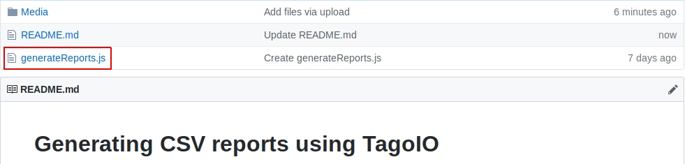
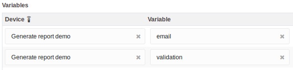
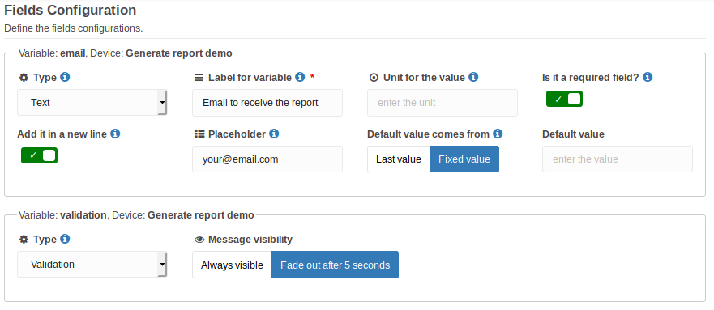
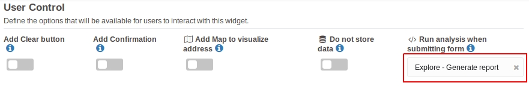
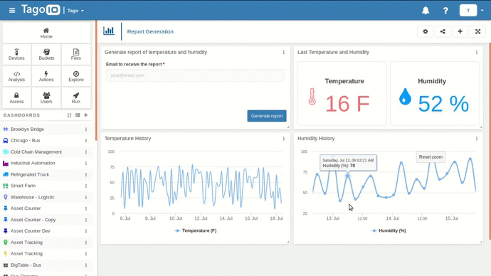
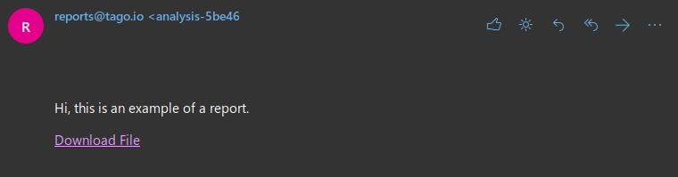

# Generating CSV reports using TagoIO
Easily generate reports on TagoIO platform using input form and analysis. What you will learn:
- How to generate reports
- How you can use reports to increase value for your application

## What do I need for generate a CSV report?
Currently, there are several applications that needs to be reported for external reasons from TagoIO. There are some ways for generate reports, but today we are going to learn how to generate CSV reports. For this task, the developer needs to already have a running application (device already setup, data on device's bucket) and need to have planned **what variables want to report**. Without having in mind what variables will be reported or having an application for report there isn't how to implement this tutorial, so it's important that the developer set this prerequisites before proceed. You also need to know some concepts like:

- How to create an analysis: https://tago.elevio.help/en/articles/120
- Environment Variables: https://tago.elevio.help/en/articles/65

## How to generate reports using input form and analysis
The reports can be generated on TagoIO platform by just using a script for an analysis and a widget (we will use the Input Form widget but you can use others for that) to run the analysis when. Now, let's go for the implementation!

### Creating the analysis used on reports generation
The reports can be generated on TagoIO platform by just using a script for an analysis. The script can be found here on Github and is named **generateReports.js**. You can check the following image if you are having trouble to find the script:



Copy the code from the file here on Github and paste it on a new analysis within your TagoIO account. After that, set the following environment variables: *device_token*, *dashboard_id* and *account_token*. If you aren't sure what values should you use on each of the variables, check the topics bellow, there are aditional explanations for each of them.

- Device Token: it's a token generated from the device you are using to work with the data you want to get on your report.
- Dashboard ID: you need to get the ID of the dashboard you will use to implement this report system.
- Account Token: token generated from the account you are using.

After you have the environment variables set up, let's go for the code.

#### Code implementation
The script **generateReports.js** is already operational and it's just a matter of ***what variables it should report***. So, remember on the beginning of this tutorial, you were asked to have in mind what variables you want to have on your report. This is the time you are going to use the variables you selected. For this tutorial I will choose the following variables: `temperature` and `humidity`. Go to the script you have paste on your report generation analysis and search for the line 23. The line 23 should have something like that:
```javascript
const data = await device.find({ variable: ['temperature', 'humidity'], start_date: '10 year', qty: 9999 });
```

That is the line we want to change, you can see there is an array on the key named *variable*. You just need to insert the variables you want to report inside this array. For example, you want the variable `battery`. Your line should be like the following:
```javascript
const data = await device.find({ variable: ['battery'], start_date: '10 year', qty: 9999 });
```

Other example, you want the variables `tension`, `electric_current` and `capacitance`, so your line should be like the following:
```javascript
const data = await device.find({ variable: ['tension', 'electric_current', 'capacitance'], start_date: '10 year', qty: 9999 });
```

That's all you have to change on the code, but, there are some other lines you can change on the script to use the report as you want. You can **customize the email** that is sent for the user by change what is written on the lines 30 to 35. You can also **customize the validation** or **customize the notification** sent to the user in the same script, just take a look on the code and you should find all you want to customize. After that, let's create the widget for our report generation system.

### Creating the input form widget to generate reports
This is, by far, the easiest part of the tutorial. We have only four steps to follow here:

- Create input form widget
- Select the variables used in the input form
- Set the variable field types
- Select the analysis that will be used to generate reports

We are going to create a widget that will have an input for the user insert his email and after the email is inserted the user will click on the button "Generate Report" to receive the link for the report on his email and also a validation on the widget giving the feedback for the user. For create this just select the dashboard you want to have a report generation system and create a input form. On the input form you should use two variables named *email* and *validation*. Like the following image:



After that, go to the fields configuration of the widget and set the type of the *email* as **Text** and the type of the *validation* as **Validation**. Like the image:



Now, go to the user control and select the report generation analysis you created before to the field *Run analysis when submitting form*. Like the image bellow:



You can also customize the text of the submit button and other options on the widget. But you only need what is written on this tutorial to get the report generations working. Check the following example using our report system in action!

#### Generating report demonstration


#### Email received with link for the report



## Simple like that!
The reports generation is just it! Try to use it and check the report you will receive on your email. You can customize, make improvements and everything else with the script and widget. If you had any troubles during the tutorial, get in touch with our team and we will be happy to help you :)

TagoIO team. 
